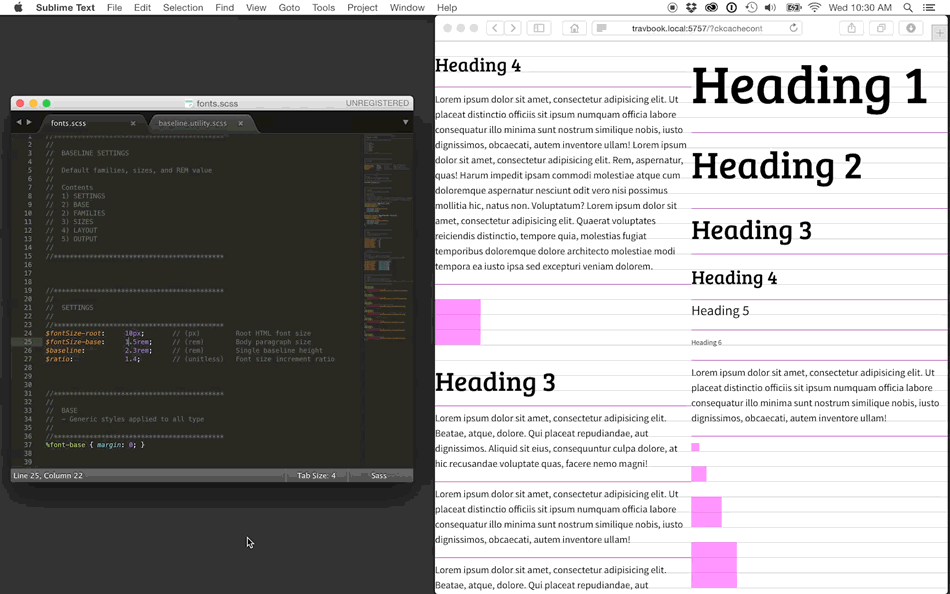
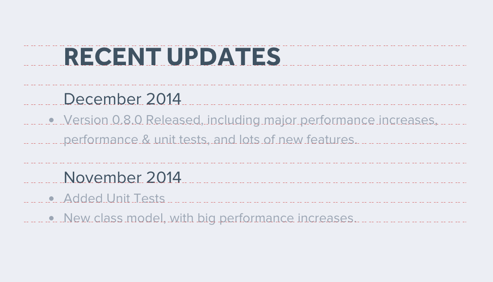

# SCSS-Baseline-Type-Utility
Automatically calculated font sizes and spacing based on a customizable ratio and baseline grid for your chosen typeface. The implementation is reductive and highly customizable to suit the needs of your project.





## Using the SCSS Baseline Type Utility
### Pick your settings
- Body size
- Unit height
- Scale ratio

These are the main settings to set up your grid. They can be adjusted at any time.


```scss
//*******************************************
//
// SETTINGS
//
//*******************************************
$fontSize-root:   10px;     // (px) Root HTML font size - 10px default
$fontSize-base:   1.5rem;   // (rem) Body paragraph size
$baseline:        2.3rem;   // (rem) Single baseline height
$ratio:           1.4;      // (unitless) Font size increment ratio
```


### Pick your font families and styles
In order to align type to its visible baseline, the baseline position needs to be known to the utility. Use the demo files to find the “Shift Ratio” value for your selected fonts. This is essentially stating how far down the font the baseline is from its vertical center. This point can vary between fonts and requires a small amount of trial and error to find the correct value. The font face will not align to its baseline grid without this value determined accurately.


```scss
//*******************************************
//
// BASE
// - Generic styles applied to all type
//
//*******************************************
%font-base { margin: 0; }

//*******************************************
//
// FAMILIES
// - Font families, weights, and styles
//
// SHIFT RATIO
// - (unitless)
// - Different for each fon
// - This value describes the location of the font's baseline as a percentage
// - Using an accurate value for each font is essential to proper alignment
//
//*******************************************
$fontFamily-primary: 'Bree Serif', serif;
$shiftRatio-primary: 0.37;
%fontFamily-primary {
    @extend %font-base;
    font-family: $fontFamily-primary;
    font-style:  normal;
    font-weight: normal;
}

$fontFamily-secondary: 'Source Sans Pro', sans-serif;
$shiftRatio-secondary: 0.32;
%fontFamily-secondary {
    @extend %font-base;
    font-family: $fontFamily-secondary;
    font-style:  normal;
    font-weight: normal;
}
```


### Pick your size increments
These values specify which ratio increments you plan on using. This way, you aren’t required to use consecutive intervals in the ratio. Layout settings can be applied to sizing and spacing properties throughout the project to keep containers aligned with the baseline grid as well.


```scss
//*******************************************
//
// SIZES
// - Font size ramp ratio increments
// - Should be unitless
//
//*******************************************
$fontSize-smallest: -1;
$fontSize-smaller:   0;
$fontSize-small:     1;
$fontSize-default:   2;
$fontSize-large:     3;
$fontSize-larger:    4;
$fontSize-largest:   5;

//*******************************************
//
// LAYOUT
// - Layout size ramp baseline increments
// - Should be unitless and used with the baseline-grid function
//
//*******************************************
$gridUnit-smallest: baselineGrid(0.5);
$gridUnit-smaller:  baselineGrid(1);
$gridUnit-small:    baselineGrid(2);
$gridUnit-default:  baselineGrid(3);
$gridUnit-large:    baselineGrid(4);
$gridUnit-larger:   baselineGrid(6);
$gridUnit-largest:  baselineGrid(8);
```


### Create the output
Create your selectors, extend your font families, and select your font-size settings and shift ratio variables. These settings can be extended throughout the project, ensuring consistency and the ability to update preferences easily. Vertical spacing can be fine-tuned by adding or subtracting the <strong>$baseline</strong> using the top or bottom margin.


```scss
h6,
.font-smallest,
%font-smallest {
    @extend %fontFamily-secondary;
    @include baselineFont( $fontSize-smallest, $shiftRatio-secondary );
}
p,
.font-smaller,
%font-smaller {
    @extend %fontFamily-secondary;
    @include baselineFont( $fontSize-smaller, $shiftRatio-secondary );
}
h5,
.font-small,
%font-small {
    @extend %fontFamily-secondary;
    @include baselineFont( $fontSize-small, $shiftRatio-secondary );
}
/* ... */
```


### Get Results
What you get is easily accessible presets to use throughout the project. They include font-family choices with automatically-calculated sizes and spacing that adhere to a custom ratio and baseline grid. The implementation is reductive and highly customizable to suit the needs of any project.



_The baseline utility, as used on the next [CreateJS.com](http://createjs.com) update._


If you found this tool useful or interesting I would be happy to hear from you via [@travismillerdes](https://twitter.com/travismillerdes) on twitter.

Check out the full article on the [gskinner blog](http://blog.gskinner.com/archives/2015/05/better-typogra…ny-web-project.html) for more information!
