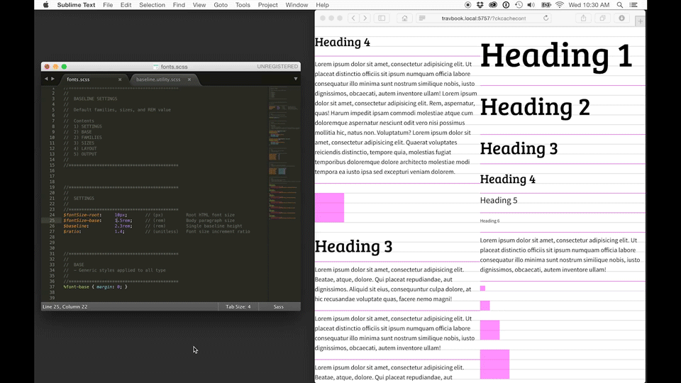

# SCSS-Baseline-Type-Utility
Automatically calculated font sizes and spacing based on a customizable ratio and baseline grid for your chosen typeface. The implementation is reductive and highly customizable to suit the needs of your project.

